# SCSC — 超電脳サイバネティクス制御システム
**Super Cybernetic System Controller — CUDA-Powered Active Inference**

> 能動的推論 (Active Inference) を NVIDIA CUDA で実装し、二足歩行ヒューマノイドロボットをリアルタイム自律制御するシステム

## Platform
`NVIDIA CUDA` `Jetson AGX Orin` `Teensy 4.1` `Manoi PF01` `Active Inference`

---

## Portfolio

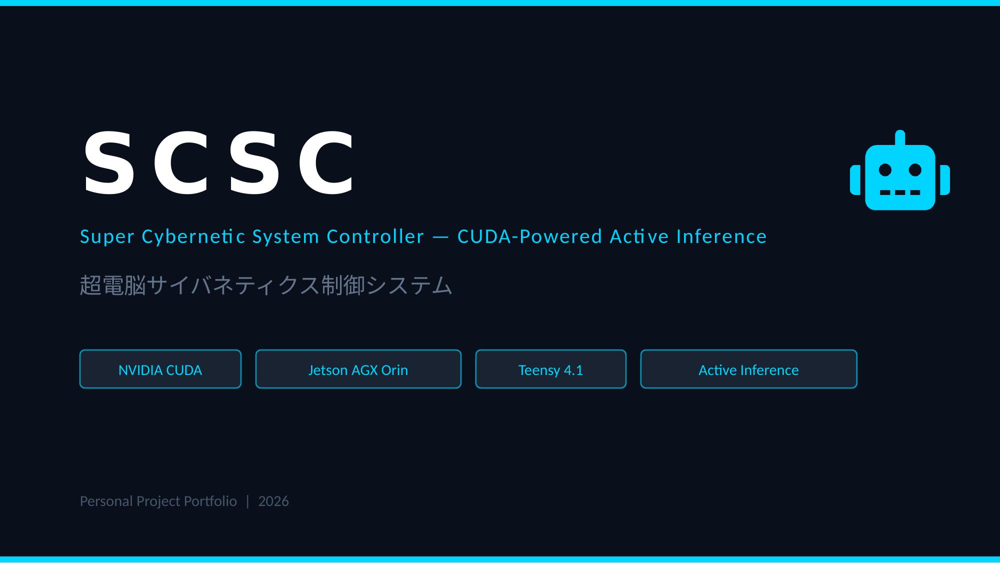
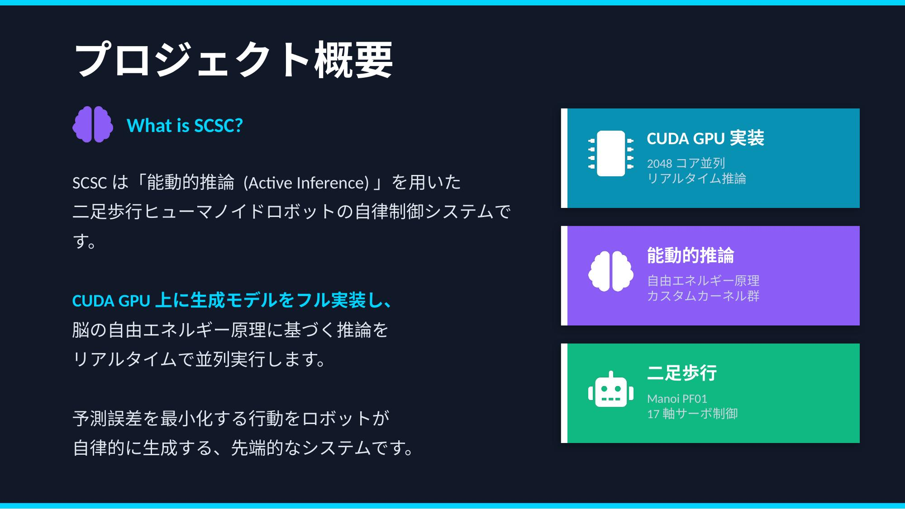
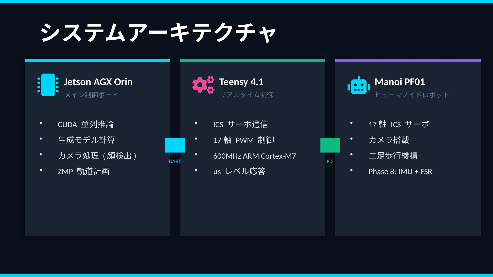
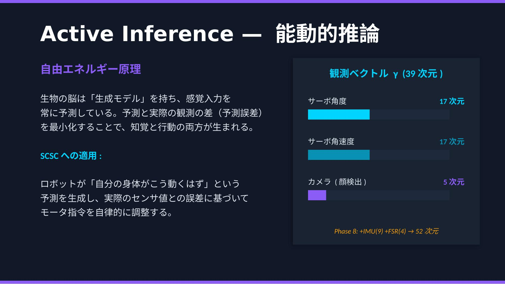
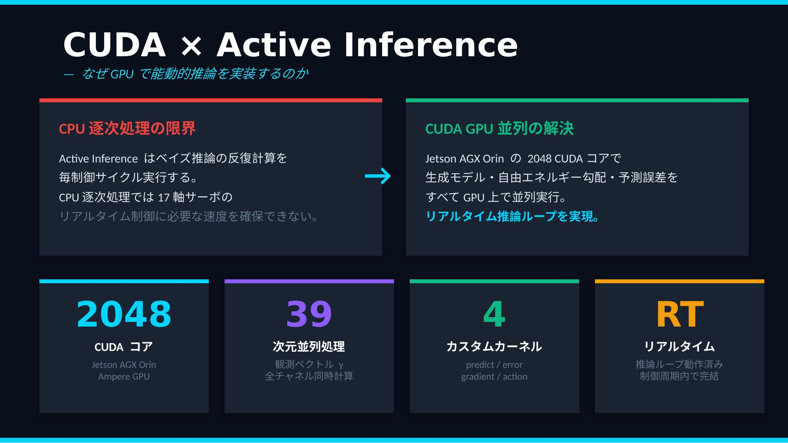
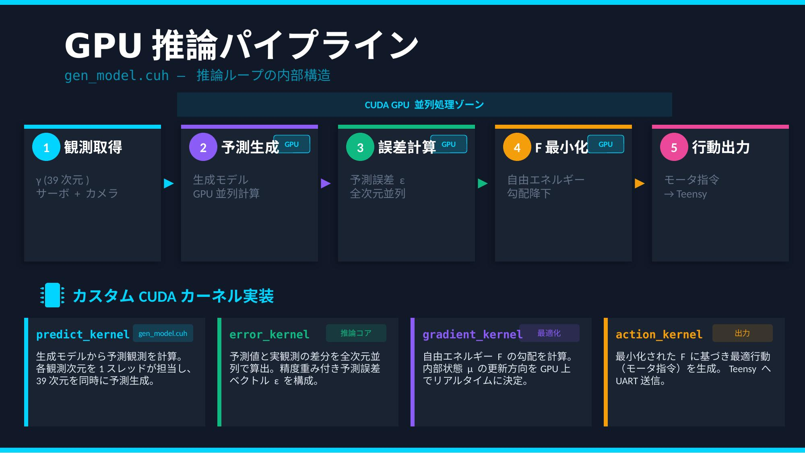
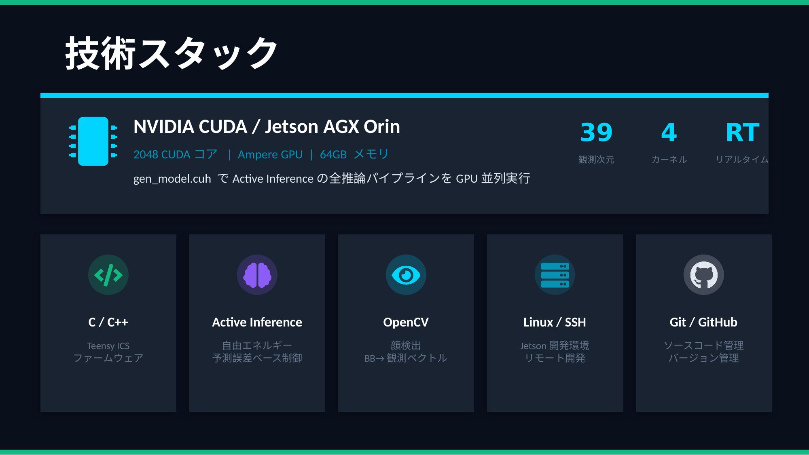
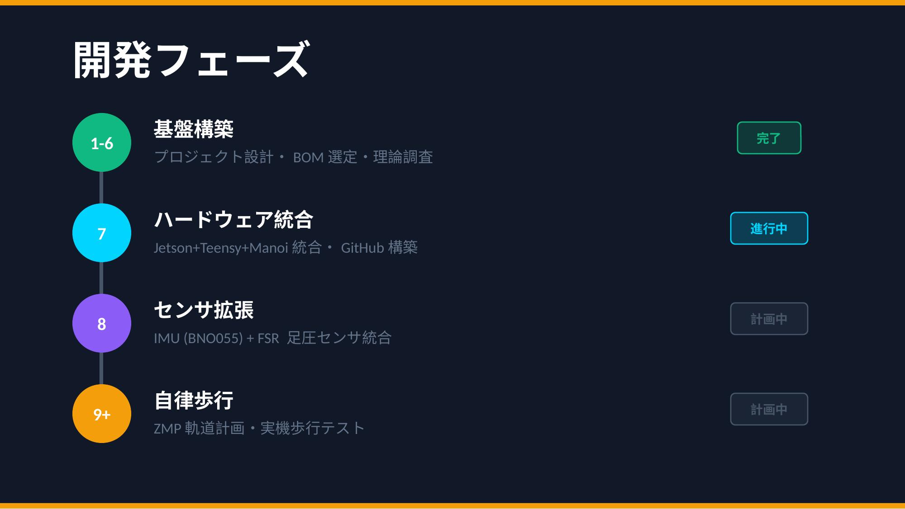
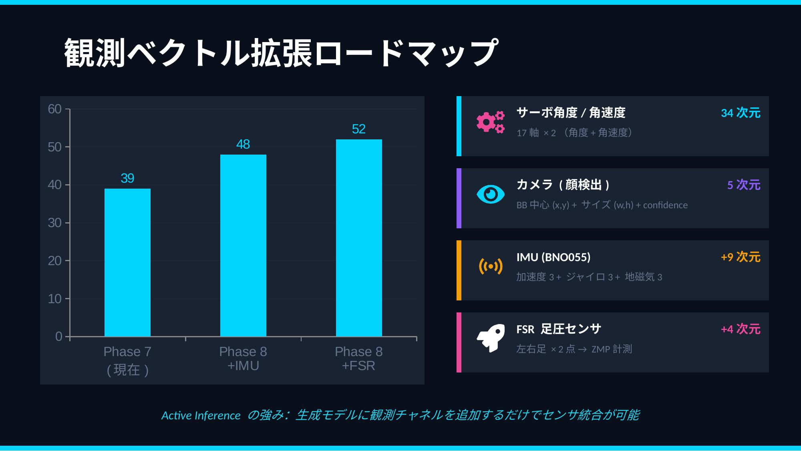
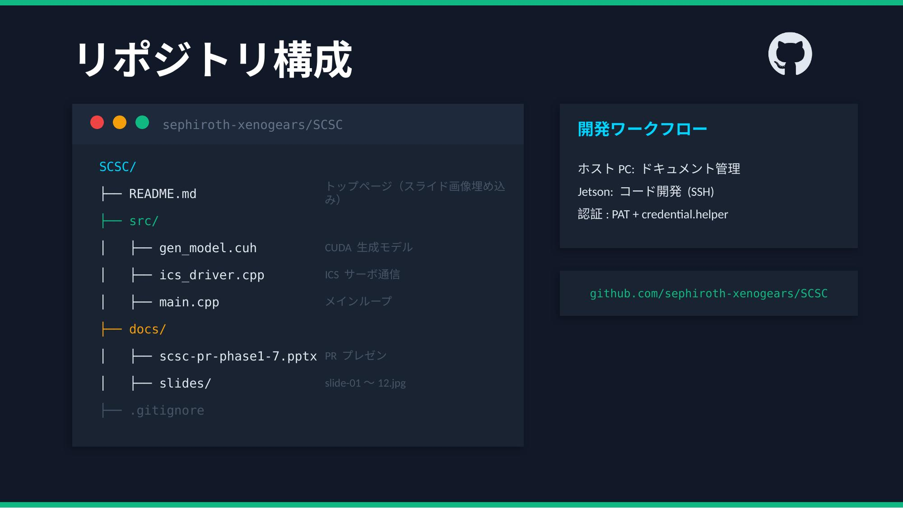
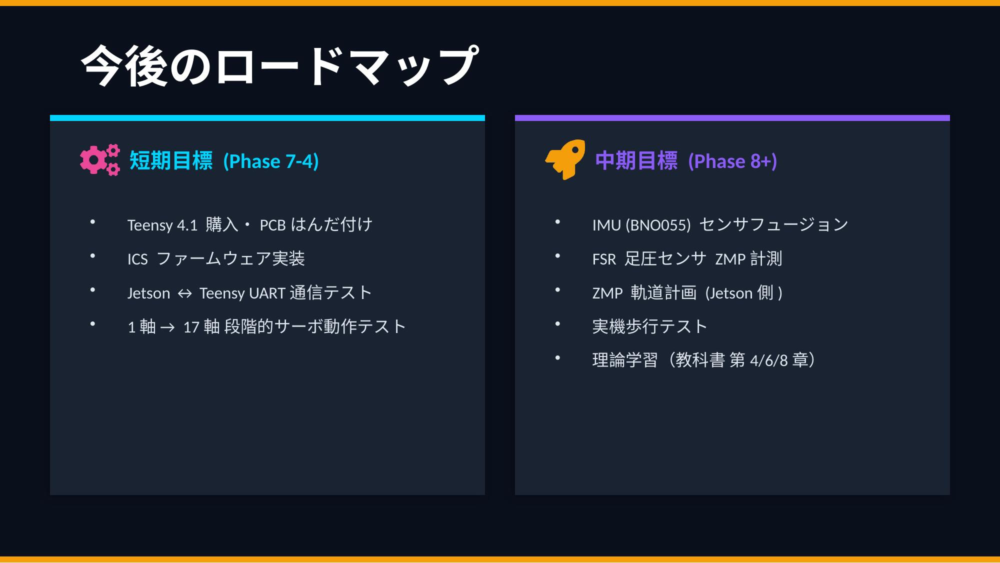
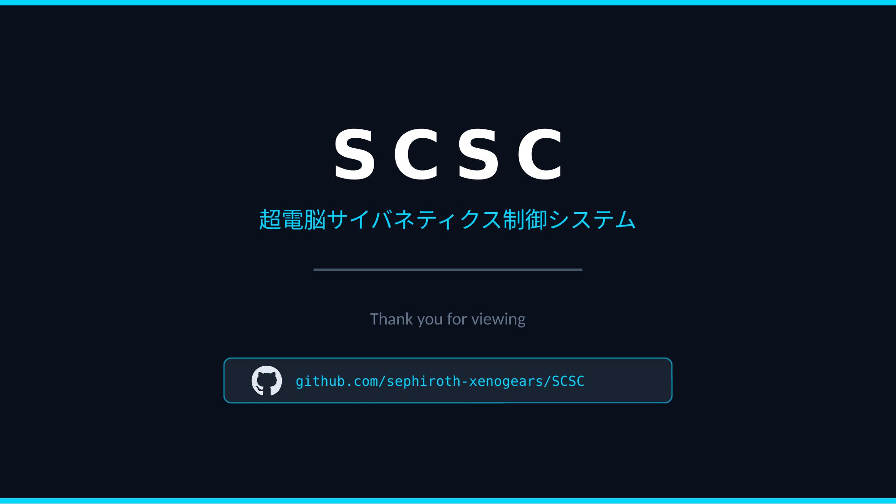

---

## Repository Structure

```
SCSC/
├── README.md
├── src/                          # Phase 7 ソースコード
│   ├── gen_model.cuh             # CUDA 生成モデル
│   ├── ics_driver.cpp            # ICS サーボ通信
│   └── main.cpp                  # メインループ
├── docs/
│   ├── scsc-pr-phase1-7.pptx     # PR プレゼンテーション
│   ├── scsc-portfolio.pptx       # ポートフォリオ
│   └── slides/                   # README 埋め込み用画像
└── .gitignore
```

## License
This project is for personal/educational purposes.
